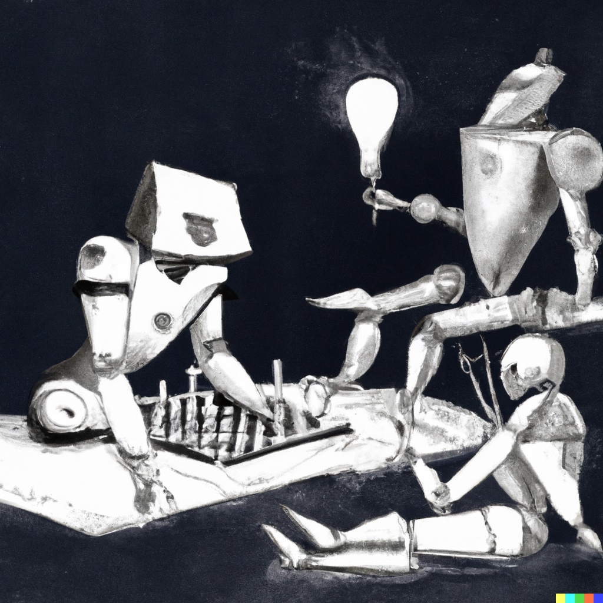
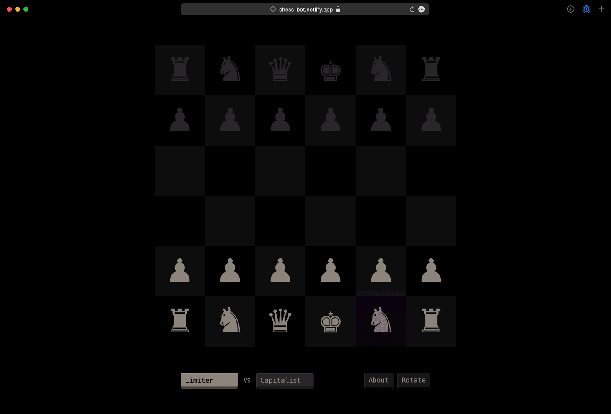

# Chess Bots

This project is a simple chess program — with hooks allowing you to easily create (and play against)
your own chess bot. See the [How To Add a Bot](./src/bots/how-to-add-a-bot.md) document for specific
instructions on how to do so. Once it's been added, you can play against it or watch it play against
other bots at [chess-bot.netlify.app](https://chess-bot.netlify.app).

The project uses [_Los Alamos_ chess](https://en.wikipedia.org/wiki/Los_Alamos_chess) (chess without
the bishop) as an homage to the first chess-playing computer program. It also helps reduce the total
calculations required for the bots to do, and throws human players' habits off. There's a full-sized
board available at [chess-bot.netlify.app/full](https://chess-bot.netlify.app/full), and a very tiny
board at [chess-bot.netlify.app/small](https://chess-bot.netlify.app/small) as well.

<br/>



<br/>

The visuals of the website (the gold swiping move animations, to be specific) are very much inspired
by [the FIDE brand](https://tinyurl.com/fide2021), designed by [Morillas](https://www.morillas.com).


### Operational Notes

The website is a _"single page app"_ built with [Vue](https://vuejs.org). All the scripting stuff is
done using [Typescript](https://www.typescriptlang.org). The project is managed by `pnpm`, which you
can find instructions to install here: [pnpm.io/installation](https://pnpm.io/installation). Updates
to the `main` branch are automatically deployed via [Netlify](https://www.netlify.com), the settings
for which can be found in the [`netlify.toml` file](./netlify.toml).

| COMMAND         | DESCRIPTION                                                                    |
|:----------------|:-------------------------------------------------------------------------------|
| `pnpm install`  | Install the project's dependencies                                             |
| `pnpm run dev`  | Build and run locally                                                          |
| `pnpm run lint` | Format according to [the styleguide](https://github.com/GoodbyteCo/Styleguide) |


#### Project Structure

Here's a little mini-map of the project:

```bash
src/
├─┬─ bots/
│ ├── how-to-add-a-bot.md  ## instructions
│ ├── index.ts   ## list of all bots
│ └── monkey.ts  ## a very simple example bot
├─┬─ components/
│ ├── Animator.vue    ## controls the move-animations
│ ├── Board.vue       ## draws (interactive) chessboard
│ ├── ChessPiece.vue  ## draws the requested piece
│ ├── CustomButton.vue
│ └── PlayerSelector.vue  ## manages bot selection
├── constants.ts          ## useful types & interfaces
├── game-controller.ts    ## runs actual game step
├── rules.ts    ## utility functions for chess rules
└── App.vue     ## main thread; renders & manages game
```
