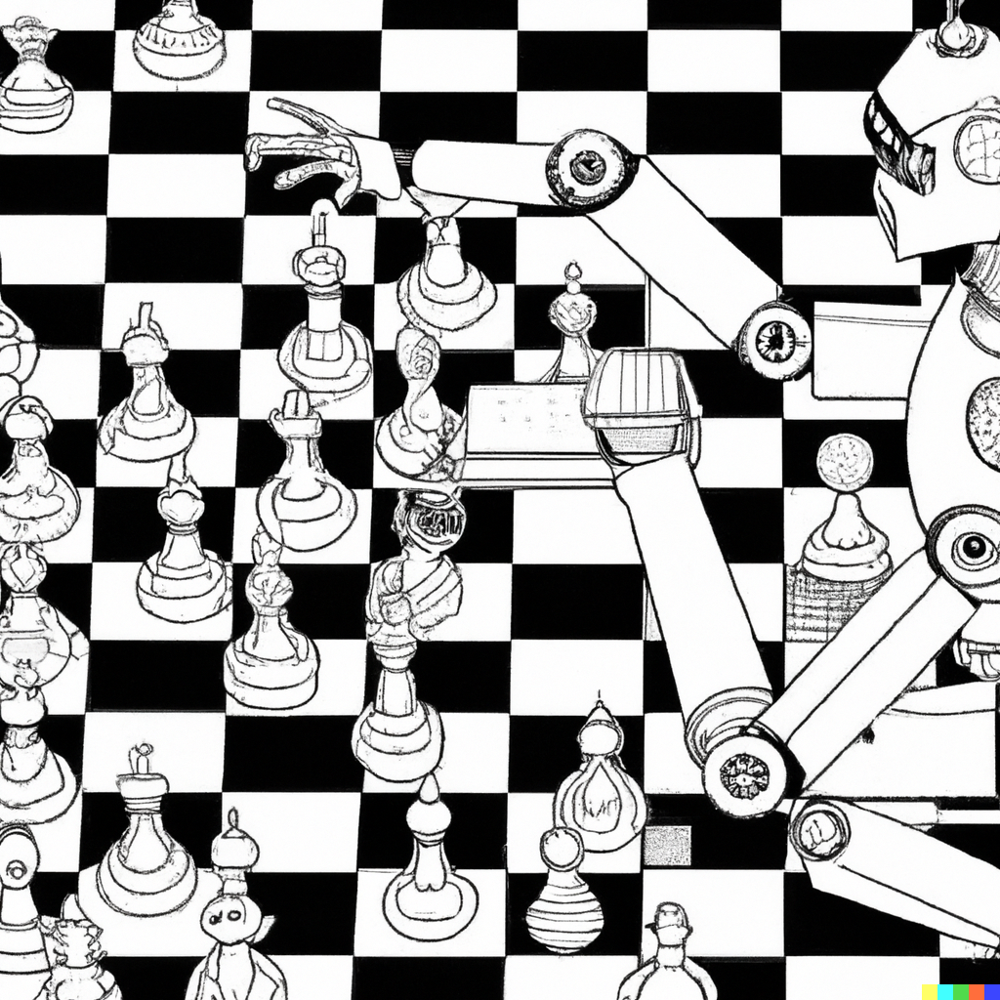

# How to add a chess bot

You've come to the right place. To start, create a new Typescript file in this directory
(`.../src/bots/`). Your bot will need to implement the `Bot` interface, like so:

```ts
import type { ChessBoard, Color, Bot, PlayerAction } from '@/constants'

export const YourBot: Bot = {
	name: 'Your Bot Name',
	move: (currentState: ChessBoard, colorToMove: Color): PlayerAction => {
		
		// ...given the current board state, and which color you are playing as,
		// return the action your bot would like to take.

	},
}
```

For a simple example, see [`monkey.ts`](./monkey.ts), which implements a bot that
just chooses moves randomly.



## Quick starts

I've done you a favour and set up a lot of the scaffolding you might need to build
your bot. If you browse the [`rules.ts`](../rules.ts) file, you'll see useful utilities
like `isLegalMove()` and `isInCheck()`. There's also a [`/bots/util.ts`](./util.ts)
file with additional helper functions, specifically for bots. For example, you can
use `visualizeHypothetical()` to see what the board will look like after a move.

The `util` file also contains a quick-start function: `allLegalMoves()`, which lets
you fetch all legal moves for your player, and ranks them according to your given
evaluation function. You can use this to set up a simple bot quite quickly -- see
[`limiter.ts`](./limiter.ts) for an example.


## Adding your bot

Add you bot to the [`/bots/index.ts`](./index.ts) file, and it will automatically
be included in the list of playable bots. Run `pnpm run dev` to test this locally.
Once you're happy with it, open a pull request and assign it to
[`@qjack001`](https://github.com/qjack001).


